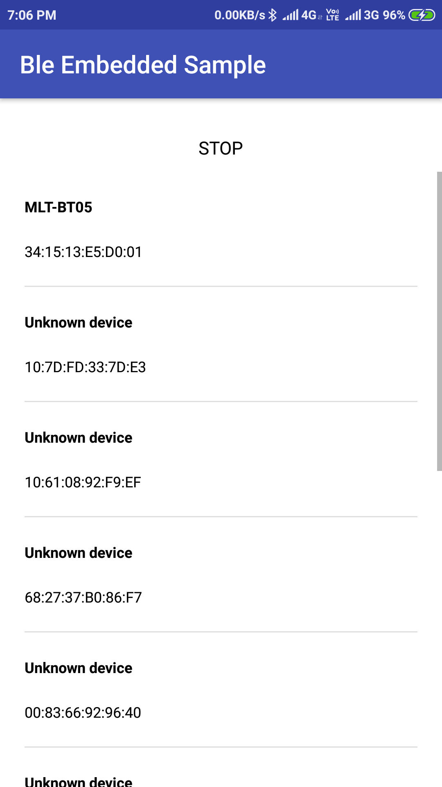
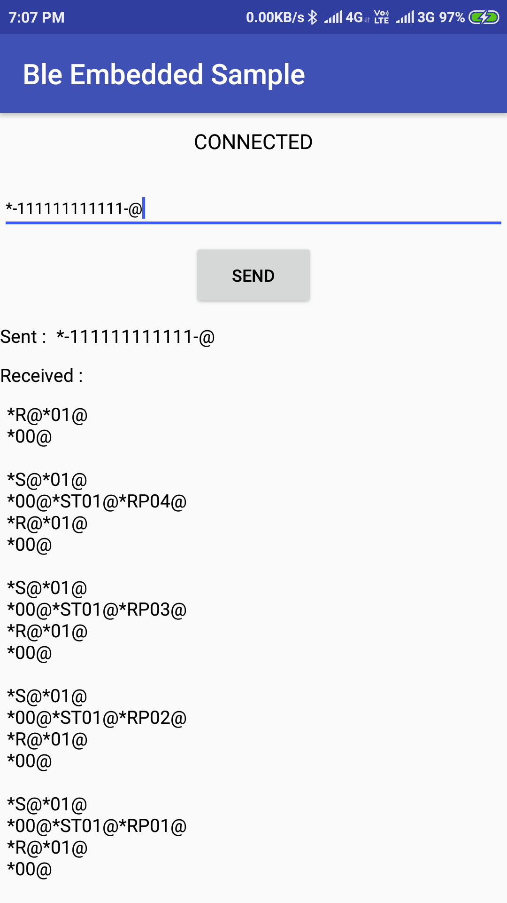
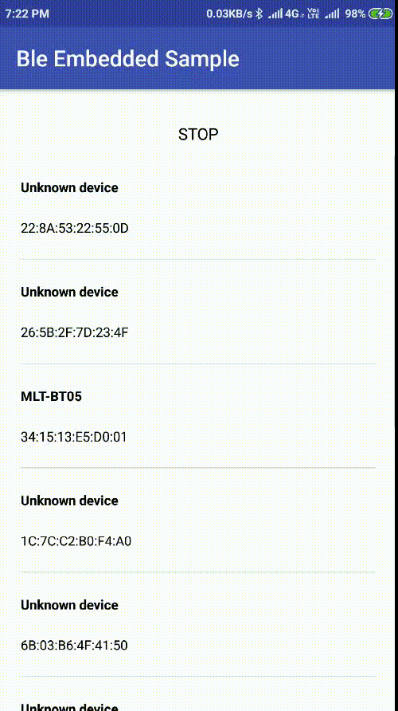

# BLE-Embedded-Sample

# Summary  
This sample demonstrates how to use the Bluetooth LE Generic Attribute Profile (GATT) to transmit arbitrary data between devices.
It shows a list of available Bluetooth LE devices and provides an interface to connect,
then user can send device related command data and in responce it shows received data if command is right.

Note : - user can change UUID related to BLE device in SampleGattAttributes.class file.

# Minimum SDK version 
- 18 (Android 4.3)

# Introduction 
This sample shows a list of available Bluetooth LE devices and provides an interface to connect, display data and display GATT services and characteristics supported by the devices.
It creates a Service for managing connection and data communication with a GATT server hosted on a given Bluetooth LE device.
The Activities communicate with the Service, which in turn interacts with the Bluetooth LE API.

# Screenshots

  

# Getting Started 
This sample uses the Gradle build system. To build this project, use the "gradlew build" command or use "Import Project" in Android Studio.

# Permission 
	//If you want your app to initiate device discovery or manipulate Bluetooth settings, you must also declare the BLUETOOTH_ADMIN permission. 
	//Note: If you use the BLUETOOTH_ADMIN permission, then you must also have the BLUETOOTH permission.
	<uses-permission android:name="android.permission.BLUETOOTH" />
	<uses-permission android:name="android.permission.BLUETOOTH_ADMIN" />
	
	//If you want to declare that your app is available to BLE-capable devices only, include the following in your app's manifest
	<uses-feature android:name="android.hardware.bluetooth_le" android:required="true" />
	
	//Location permission is required for BLE scanned device list, otherwise ble scan is not show available devices
	<uses-permission android:name="android.permission.ACCESS_FINE_LOCATION" />
